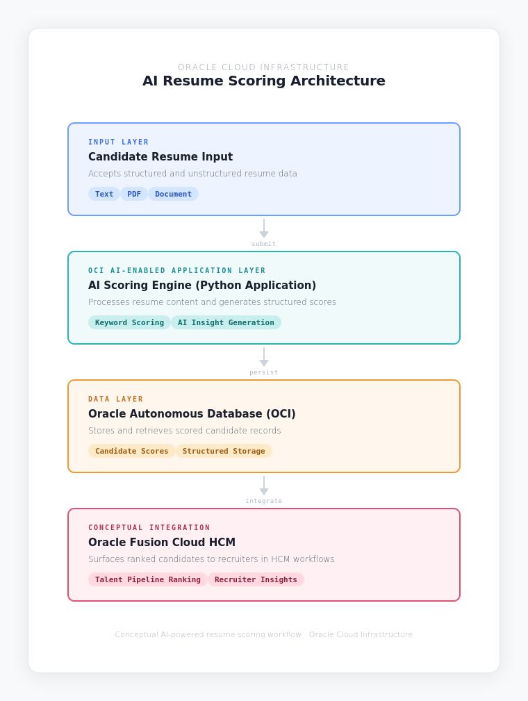

# oci-ai-resume-scoring-demo
Demonstrating OCI concepts using resume scoring logic and Autonomous Database integration.

## Objective
To simulate an resume scoring system that could conceptually integrate with HCM Talent Acquisition workflows.

## Concepts Demonstrated
Keyword-based scoring logic 
OCI-compatible Python development
Potential integration with Autonomous Database
Talent intelligence use case design

## Future Enhancements
Use OCI Generative AI for semantic scoring
Deploy as OCI Function

## 🏗 Architecture Overview

This diagram represents a conceptual AI-powered resume scoring workflow using Oracle Cloud Infrastructure services and potential integration with Oracle Fusion Cloud HCM.
